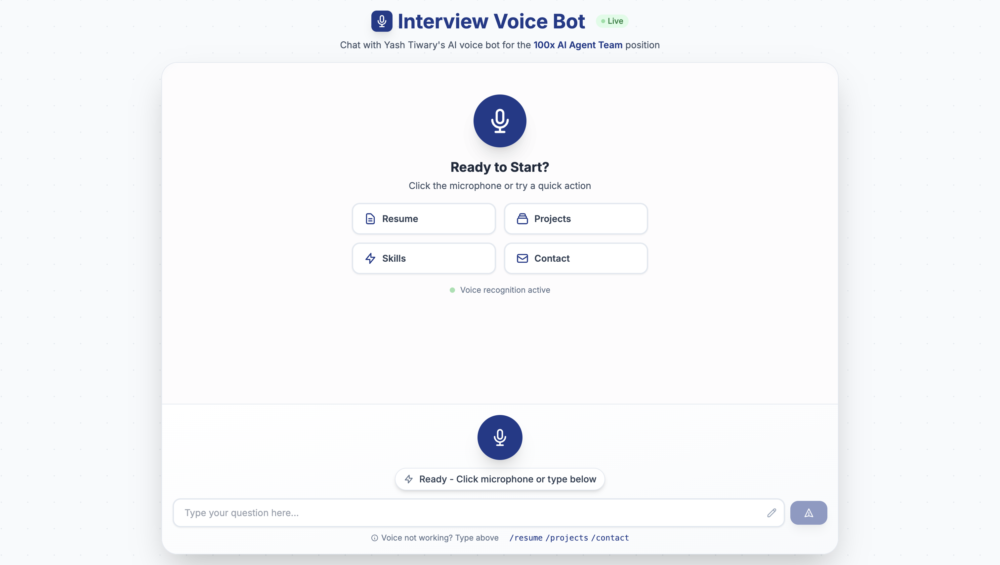

# AI Voice Interview Bot

An intelligent voice-powered interview bot built for the 100x AI Agent Team position. Features speech recognition, AI-powered responses, and an interactive UI for professional interviews.

## Screenshots

### Landing Page


### Voice Interview Interface


## Features

- **Voice Recognition** - Real-time speech-to-text using Web Speech API
- **AI-Powered Responses** - Strategic answers using Groq's Llama 3.3 70B
- **Empathic Text-to-Speech** - Natural voice using Hume AI
- **Quick Action Buttons** - Fast access to Resume, Projects, Skills, Contact
- **Smart Suggestions** - Context-aware follow-up questions
- **Interactive Resume** - Downloadable PDF with preview
- **Project Portfolio** - Detailed showcase with metrics
- **Command System** - Special commands (`/resume`, `/projects`, `/contact`)

## Architecture

```
100x-assignment/
├── backend/              # FastAPI Backend
│   ├── main.py          # API endpoints and AI logic
│   ├── requirements.txt # Python dependencies
│   └── README.md        # Backend documentation
├── frontend/            # Next.js Frontend
│   ├── src/
│   │   ├── app/        # Pages and layouts
│   │   └── components/ # React components
│   ├── public/         # Static assets
│   └── package.json    # Dependencies
└── README.md           # This file
```

## Tech Stack

**Backend:** FastAPI, Groq API (Llama 3.3 70B), Hume AI, Python 3.13, Uvicorn

**Frontend:** Next.js 14, TypeScript, Tailwind CSS, Web Speech API, Axios

## Quick Start

### Prerequisites
- Python 3.13+
- Node.js 18+
- Groq API Key (free at [console.groq.com](https://console.groq.com))
- Hume AI API Key (free at [platform.hume.ai](https://platform.hume.ai))

### Backend Setup

```bash
cd backend

# Create virtual environment
python3 -m venv venv
source venv/bin/activate  # On Windows: venv\Scripts\activate

# Install dependencies
pip install -r requirements.txt

# Create .env file
cat > .env << EOF
GROQ_API_KEY=your_groq_api_key_here
HUME_API_KEY=your_hume_api_key_here
HUME_API_KEY_BACKUP=your_backup_key  # Optional
EOF

# Run server
uvicorn main:app --reload --host 0.0.0.0 --port 8000
```

### Frontend Setup

```bash
cd frontend

# Install dependencies
npm install

# Create .env.local
echo "NEXT_PUBLIC_API_URL=http://localhost:8000" > .env.local

# Run development server
npm run dev
```

Open [http://localhost:3000](http://localhost:3000) in your browser.

## Usage

1. **Landing Page** - View skills and professional stats
2. **Start Interview** - Click "Start Voice Interview"
3. **Interact** - Click microphone to speak or type your question
4. **Quick Actions** - Use buttons for Resume, Projects, Skills, Contact
5. **Commands** - Type `/resume`, `/projects`, or `/contact`

## Environment Variables

### Backend (.env)
```bash
GROQ_API_KEY=your_groq_api_key_here
HUME_API_KEY=your_hume_api_key_here
HUME_API_KEY_BACKUP=optional_backup_key  # Fallback when primary hits limit
```

### Frontend (.env.local)
```bash
NEXT_PUBLIC_API_URL=http://localhost:8000
```

## API Testing

```bash
# Health check
curl http://localhost:8000/health

# Chat endpoint
curl -X POST http://localhost:8000/chat \
  -H "Content-Type: application/json" \
  -d '{"messages": [{"role": "user", "content": "What is your superpower?"}]}'
```

## Deployment

### Frontend (Vercel)

```bash
cd frontend
vercel --prod
```

### Backend (Railway)

1. Push to GitHub
2. Connect repository to Railway
3. Set root directory to `backend`
4. Add environment variables (GROQ_API_KEY, HUME_API_KEY)
5. Deploy

### Update Frontend API URL

After backend deployment, update Vercel environment variable:
```bash
NEXT_PUBLIC_API_URL=https://your-backend.railway.app
```

## Project Highlights

### Technical Achievements
- 2+ years in AI Engineering
- 12+ production systems built
- 15+ technologies mastered

### Real Impact
- 65% faster contract review times
- 92% accuracy in AI models
- 99.9% uptime for production systems
- 100+ tenants served on SaaS platform

## Documentation

- [Backend Documentation](./backend/README.md) - Backend API and configuration
- [Frontend Documentation](./frontend/README.md) - Frontend setup and features

## About

Built by **Yash Tiwary** for the 100x AI Agent Team position.

- Email: yash.r.tiwary@gmail.com
- LinkedIn: [linkedin.com/in/yash-tiwary](https://linkedin.com/in/yash-tiwary)
- GitHub: [github.com/tiwaryash](https://github.com/tiwaryash)
- Website: [yashtiwary.com](https://yashtiwary.com)

## License

This project is part of the 100x interview process.
